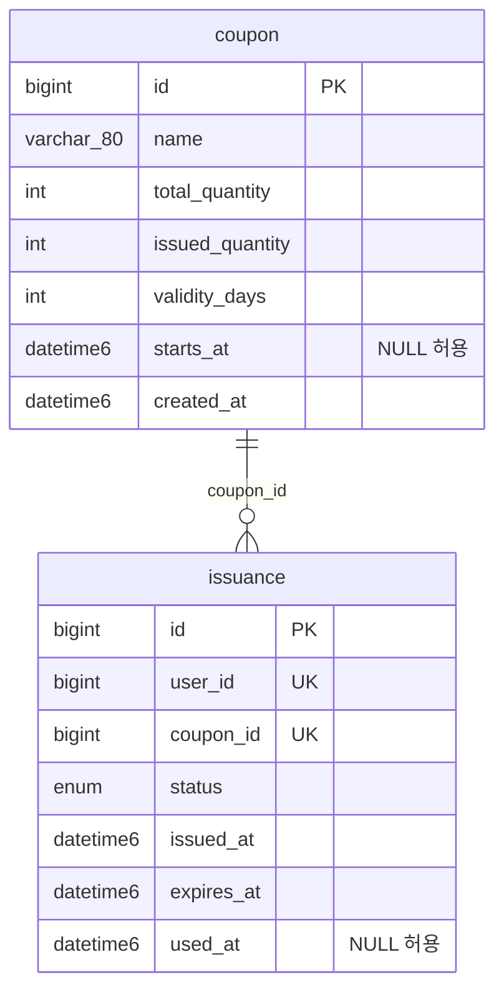

# DB 테이블 구조

선착순 쿠폰 발급 서비스의 테이블 정의. 2026-08-12 기준.

- **DB**: MySQL 8.4.10 (InnoDB), `utf8mb4` / `utf8mb4_0900_ai_ci`
- **격리 수준**: `REPEATABLE-READ`
- **스키마 관리**: `spring.jpa.hibernate.ddl-auto: update` (엔티티에서 자동 생성)

테이블은 **`coupon`**, **`issuance`** 두 개다.



구조상 알아둘 점 세 가지:

- **FK 제약이 없다.** `issuance.coupon_id` 는 그냥 `bigint` 다. 엔티티도 `@ManyToOne` 이 아니라 `var couponId: Long` 이라는 원시 값으로 들고 있다.
- **`user` 테이블이 없다.** 사용자는 `X-User-Id` 헤더로 넘어오는 `Long` 값일 뿐이며 이 서비스는 저장하지 않는다.
- **`version` 컬럼이 없다.** `@Version` 필드가 없어 낙관적 락을 쓸 수 없는 상태다.

---

## `coupon`

쿠폰의 정의와 재고.

엔티티: `src/main/kotlin/com/example/coupon/domain/Coupon.kt`

| 컬럼 | 타입 | Null | 기본값 | 엔티티 필드 | 설명 |
|---|---|---|---|---|---|
| `id` | `bigint` | NOT NULL | `AUTO_INCREMENT` | `id: Long?` | PK. `GenerationType.IDENTITY` |
| `name` | `varchar(80)` | NOT NULL | — | `name: String` | 쿠폰 이름 |
| `total_quantity` | `int` | NOT NULL | — | `totalQuantity: Int` | **총 재고.** 발급 상한 |
| `issued_quantity` | `int` | NOT NULL | `0` (앱) | `issuedQuantity: Int` | **발급된 수량.** 동시성 제어 대상 |
| `validity_days` | `int` | NOT NULL | `7` (앱) | `validityDays: Int` | 발급 시점부터의 유효 일수 |
| `starts_at` | `datetime(6)` | NULL 허용 | `null` | `startsAt: LocalDateTime?` | 발급 시작 시각. `null` 이면 즉시 오픈 |
| `created_at` | `datetime(6)` | NOT NULL | 생성 시각 (앱) | `createdAt: LocalDateTime` | `updatable = false` |

**인덱스**: PK(`id`) 뿐.

`기본값 (앱)` 은 DB DEFAULT 절이 아니라 Kotlin 기본 인자로 채워진다는 뜻이다. DB 레벨에는 DEFAULT가 없다.

**도메인 메서드**

```kotlin
fun isBookingOpen(now: LocalDateTime): Boolean =
    startsAt?.let { !now.isBefore(it) } ?: true
```

---

## `issuance`

누가 어떤 쿠폰을 발급받았고 지금 어떤 상태인지.

엔티티: `src/main/kotlin/com/example/coupon/domain/Issuance.kt`

| 컬럼 | 타입 | Null | 기본값 | 엔티티 필드 | 설명 |
|---|---|---|---|---|---|
| `id` | `bigint` | NOT NULL | `AUTO_INCREMENT` | `id: Long?` | PK. `GenerationType.IDENTITY` |
| `user_id` | `bigint` | NOT NULL | — | `userId: Long` | `X-User-Id` 헤더 값. FK 아님 |
| `coupon_id` | `bigint` | NOT NULL | — | `couponId: Long` | `coupon.id` 를 논리적으로 참조. FK 아님 |
| `status` | `enum('EXPIRED','ISSUED','USED')` | NOT NULL | `ISSUED` (앱) | `status: IssuanceStatus` | `@Enumerated(STRING)`, `length = 16` |
| `issued_at` | `datetime(6)` | NOT NULL | — | `issuedAt: LocalDateTime` | 발급 시각. `updatable = false` |
| `expires_at` | `datetime(6)` | NOT NULL | — | `expiresAt: LocalDateTime` | 만료 시각 = `issuedAt + validityDays` |
| `used_at` | `datetime(6)` | NULL 허용 | `null` | `usedAt: LocalDateTime?` | 사용 시각. 미사용이면 `null` |

**제약 및 인덱스**

| 이름 | 종류 | 컬럼 | 목적 |
|---|---|---|---|
| (PK) | PRIMARY KEY | `id` | |
| `uk_issuance_user_coupon` | UNIQUE | `(user_id, coupon_id)` | **1인 1매 보장.** 중복 발급을 DB 레벨에서 차단 |
| `idx_issuance_status` | INDEX | `status` | 상태별 조회 |
| `idx_issuance_coupon` | INDEX | `coupon_id` | 쿠폰별 발급 내역 조회 |

`uk_issuance_user_coupon` 이 `(user_id, coupon_id)` 순서이므로 **`user_id` 단독 조회에도 이 인덱스가 쓰인다.** 따라서 `findByUserIdOrderByIssuedAtDesc` 를 위한 별도 인덱스는 필요 없다.

**도메인 메서드**

```kotlin
fun isExpired(now: LocalDateTime): Boolean = !now.isBefore(expiresAt)   // now >= expiresAt
fun markUsed(now: LocalDateTime) { status = IssuanceStatus.USED; usedAt = now }
fun markExpired() { status = IssuanceStatus.EXPIRED }
```

### `status` 값

`src/main/kotlin/com/example/coupon/domain/IssuanceStatus.kt`

| 값 | 의미 |
|---|---|
| `ISSUED` | 발급됨, 미사용 (기본 상태) |
| `USED` | 사용 완료 |
| `EXPIRED` | 만료됨 |

```
  (없음) ──발급──> ISSUED ──사용──> USED
                     │
                     └──유효기간 경과──> EXPIRED
```

Hibernate 7 은 `@Enumerated(STRING)` 을 `varchar` 가 아니라 **네이티브 MySQL `ENUM`** 타입으로 생성한다. 나중에 값을 추가하려면 `ALTER TABLE` 이 필요하다.

---

## ⚠️ 현재 실제 DB와의 차이

위 표는 **엔티티 코드 기준**이다. 지금 돌고 있는 MySQL의 실제 스키마는 두 군데가 다르다. 엔티티가 컴파일되지 않는 상태라 `ddl-auto: update` 가 아직 최신 매핑을 반영하지 못했기 때문이다.

| 항목 | 실제 DB | 엔티티 | 영향 |
|---|---|---|---|
| `issuance.expired_at` | `datetime(6) **NOT NULL**` 로 **존재함** | 없음 (매핑 안 함) | 🔴 **INSERT 100% 실패** |
| `issuance.status` | `DEFAULT NULL` (nullable) | `nullable = false` | 🟡 DB가 NOT NULL을 강제하지 않음 |

### `expired_at` 유령 컬럼

기본값이 없는 `NOT NULL` 컬럼인데 엔티티가 매핑하지 않으므로, INSERT 시 값이 안 들어가서 실패한다. `sql_mode` 에 `STRICT_TRANS_TABLES` 가 켜져 있다.

```sql
INSERT INTO issuance (user_id, coupon_id, status, issued_at, expires_at)
VALUES (1, 1, 'ISSUED', NOW(6), NOW(6));
-- ERROR 1364 (HY000): Field 'expired_at' doesn't have a default value
```

`coupon`, `issuance` 모두 **행 수 0** 이다. 발급이 한 번도 성공한 적이 없다.

**원인** — 컬럼 순서가 증거다. 최초 생성 시점 컬럼들은 알파벳순(`coupon_id`, `expired_at`, `issued_at`, `status`, `used_at`, `user_id`)인데 `expires_at` 만 맨 뒤에 붙어 있다. 엔티티 필드를 `expiredAt` → `expiresAt` 으로 **이름만 바꿨고**, `ddl-auto: update` 가 새 컬럼을 ADD 했지만 옛 컬럼은 DROP 하지 않았다.

> `ddl-auto: update` 는 **절대 컬럼을 지우지 않는다.** 추가만 한다.
> 필드 이름을 바꾸면 "이름이 바뀐 같은 컬럼"이 아니라 **컬럼이 하나 더 생긴다.**

**해결** — 개발 단계이므로 볼륨째 밀고 다시 만드는 쪽이 깔끔하다.

```powershell
docker compose down -v      # -v 로 mysql-data 볼륨까지 삭제
docker compose up -d
```

데이터를 남겨야 하면 컬럼만 지운다.

```sql
ALTER TABLE issuance DROP COLUMN expired_at;
```

---

## 참고: 기준 DDL

엔티티가 의도하는 최종 형태. `ddl-auto` 없이 직접 만들거나 나중에 Flyway로 옮길 때의 출발점.

```sql
CREATE TABLE `coupon` (
  `id`              bigint       NOT NULL AUTO_INCREMENT,
  `name`            varchar(80)  NOT NULL,
  `total_quantity`  int          NOT NULL,
  `issued_quantity` int          NOT NULL,
  `validity_days`   int          NOT NULL,
  `starts_at`       datetime(6)      NULL,
  `created_at`      datetime(6)  NOT NULL,
  PRIMARY KEY (`id`)
) ENGINE=InnoDB DEFAULT CHARSET=utf8mb4 COLLATE=utf8mb4_0900_ai_ci;

CREATE TABLE `issuance` (
  `id`         bigint      NOT NULL AUTO_INCREMENT,
  `user_id`    bigint      NOT NULL,
  `coupon_id`  bigint      NOT NULL,
  `status`     enum('EXPIRED','ISSUED','USED') NOT NULL,
  `issued_at`  datetime(6) NOT NULL,
  `expires_at` datetime(6) NOT NULL,
  `used_at`    datetime(6)     NULL,
  PRIMARY KEY (`id`),
  UNIQUE KEY `uk_issuance_user_coupon` (`user_id`, `coupon_id`),
  KEY `idx_issuance_status` (`status`),
  KEY `idx_issuance_coupon` (`coupon_id`)
) ENGINE=InnoDB DEFAULT CHARSET=utf8mb4 COLLATE=utf8mb4_0900_ai_ci;
```

## 참고: 확인용 명령어

```powershell
# 스키마 확인
docker exec coupon-mysql-1 mysql -ucoupon -pcoupon coupon -e "SHOW CREATE TABLE issuance\G"

# 행 수 확인
docker exec coupon-mysql-1 mysql -ucoupon -pcoupon coupon -e "SELECT COUNT(*) FROM coupon; SELECT COUNT(*) FROM issuance;"

# 발급 현황
docker exec coupon-mysql-1 mysql -ucoupon -pcoupon coupon -e "SELECT c.id, c.name, c.total_quantity, c.issued_quantity, COUNT(i.id) AS actual FROM coupon c LEFT JOIN issuance i ON i.coupon_id = c.id GROUP BY c.id;"
```

마지막 쿼리의 `issued_quantity` 와 `actual` 이 어긋나면 갱신 유실(동시성 버그)이 발생한 것이다.
