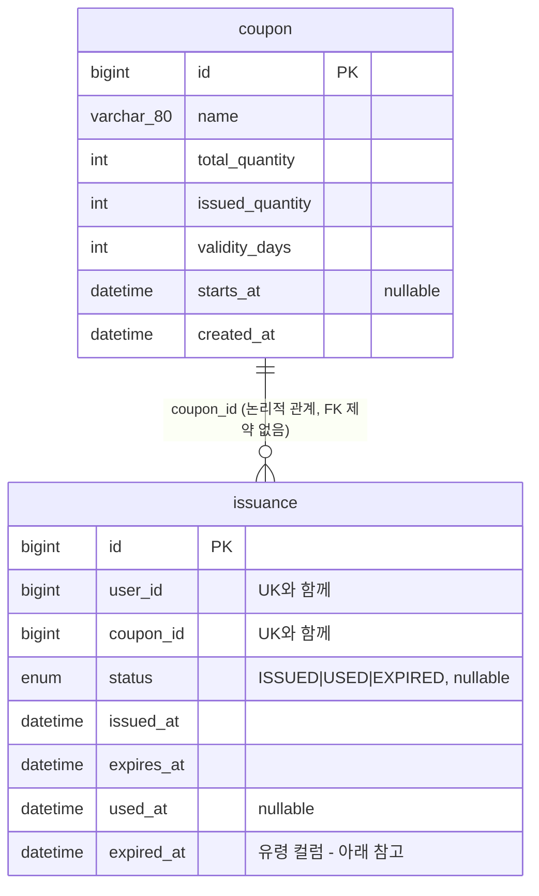

# 도메인 모델 / DB 스키마

선착순 쿠폰 발급 서비스의 도메인 구조 참고 문서.
엔티티 코드와 **실제 MySQL 스키마를 대조해서** 작성했다. 2026-08-12 기준.

## 환경

| 항목 | 값 |
|---|---|
| DB | MySQL **8.4.10** (InnoDB) |
| 격리 수준 | `REPEATABLE-READ` (MySQL 기본값) |
| `sql_mode` | `ONLY_FULL_GROUP_BY, STRICT_TRANS_TABLES, NO_ZERO_IN_DATE, NO_ZERO_DATE, ERROR_FOR_DIVISION_BY_ZERO, NO_ENGINE_SUBSTITUTION` |
| 문자셋 | `utf8mb4` / `utf8mb4_0900_ai_ci` |
| 스키마 관리 | `spring.jpa.hibernate.ddl-auto: update` |
| ORM | Hibernate 7.4.1 (Spring Boot 4.1.0, Spring Data JPA) |

## 전체 구조



**FK 제약이 없다.** `issuance.coupon_id` 는 그냥 `bigint` 이고 `coupon.id` 를 참조하는 제약이 걸려 있지 않다. 엔티티에서도 `@ManyToOne` 이 아니라 `var couponId: Long` 이라는 원시 값으로 들고 있다. 연관관계 대신 ID 참조를 쓰는 설계.

`user` 테이블은 없다. 사용자는 `X-User-Id` 헤더로 전달되는 `Long` 값일 뿐이며, 이 서비스는 사용자를 저장하지 않는다.

---

## `coupon`

발급 대상이 되는 쿠폰의 정의와 재고.

**엔티티** — `src/main/kotlin/com/example/coupon/domain/Coupon.kt`

| DB 컬럼 | DB 타입 | 엔티티 필드 | Kotlin 타입 | Null | 설명 |
|---|---|---|---|---|---|
| `id` | `bigint AUTO_INCREMENT` | `id` | `Long?` | PK | `GenerationType.IDENTITY` |
| `name` | `varchar(80)` | `name` | `String` | NOT NULL | 쿠폰 이름 |
| `total_quantity` | `int` | `totalQuantity` | `Int` | NOT NULL | **총 재고**. 발급 상한 |
| `issued_quantity` | `int` | `issuedQuantity` | `Int` | NOT NULL | **발급된 수량**. 기본값 0. 동시성 문제의 진원지 |
| `validity_days` | `int` | `validityDays` | `Int` | NOT NULL | 발급 시점부터 며칠간 유효한지. 기본값 7 |
| `starts_at` | `datetime(6)` | `startsAt` | `LocalDateTime?` | NULL 허용 | 발급 시작 시각. `null` 이면 **즉시 오픈** |
| `created_at` | `datetime(6)` | `createdAt` | `LocalDateTime` | NOT NULL | 생성 시각. `updatable = false` |

**인덱스** — PK(`id`) 뿐. 별도 인덱스 없음.

**도메인 메서드**

```kotlin
fun isBookingOpen(now: LocalDateTime): Boolean =
    startsAt?.let { !now.isBefore(it) } ?: true      // startsAt 이 null 이면 항상 열림

fun isSoldOut(): Boolean = issuedQuantity >= totalQuantity
```

**낙관적 락 없음.** `@Version` 필드가 없어서 `version` 컬럼도 없다.

---

## `issuance`

"누가 어떤 쿠폰을 발급받았고 지금 어떤 상태인가"를 나타내는 발급 이력.

**엔티티** — `src/main/kotlin/com/example/coupon/domain/Issuance.kt`

| DB 컬럼 | DB 타입 | 엔티티 필드 | Kotlin 타입 | Null | 설명 |
|---|---|---|---|---|---|
| `id` | `bigint AUTO_INCREMENT` | `id` | `Long?` | PK | `GenerationType.IDENTITY` |
| `user_id` | `bigint` | `userId` | `Long` | NOT NULL | `X-User-Id` 헤더 값. FK 아님 |
| `coupon_id` | `bigint` | `couponId` | `Long` | NOT NULL | `coupon.id` 를 논리적으로 참조. FK 아님 |
| `status` | `enum('EXPIRED','ISSUED','USED')` | `status` | `IssuanceStatus` | **NULL 허용** ⚠️ | 기본값 `ISSUED`. 아래 "알려진 문제" 참고 |
| `issued_at` | `datetime(6)` | `issuedAt` | `LocalDateTime` | NOT NULL | 발급 시각. `updatable = false` |
| `expires_at` | `datetime(6)` | `expiresAt` | `LocalDateTime` | NOT NULL | 만료 시각 = `issuedAt + validityDays` |
| `used_at` | `datetime(6)` | `usedAt` | `LocalDateTime?` | NULL 허용 | 사용 시각. 미사용이면 `null` |
| `expired_at` | `datetime(6)` | **(매핑 없음)** | — | **NOT NULL** ⚠️ | **유령 컬럼. 현재 발급을 100% 실패시킨다.** 아래 참고 |

**제약 및 인덱스**

| 이름 | 종류 | 컬럼 | 목적 |
|---|---|---|---|
| `uk_issuance_user_coupon` | UNIQUE | `(user_id, coupon_id)` | **1인 1매 보장.** 중복 발급을 DB 레벨에서 차단 |
| `idx_issuance_status` | INDEX | `status` | 상태별 조회 |
| `idx_issuance_coupon` | INDEX | `coupon_id` | 쿠폰별 발급 내역 조회 |

`uk_issuance_user_coupon` 은 `(user_id, coupon_id)` 순서이므로 `user_id` 단독 조회에도 쓰인다.
따라서 `findByUserIdOrderByIssuedAtDesc` 는 이 유니크 인덱스를 탄다.

**도메인 메서드**

```kotlin
fun isExpired(now: LocalDateTime): Boolean = !now.isBefore(expiresAt)   // now >= expiresAt

fun markUsed(now: LocalDateTime) {
    status = IssuanceStatus.ISSUED     // ⚠️ USED 여야 한다. 아래 참고
    usedAt = now
}
```

---

## `IssuanceStatus`

`src/main/kotlin/com/example/coupon/domain/IssuanceStatus.kt`

| 값 | 의미 |
|---|---|
| `ISSUED` | 발급됨. 아직 사용하지 않음 (기본 상태) |
| `USED` | 사용 완료 |
| `EXPIRED` | 만료됨 |

의도된 상태 전이:

```
        발급                사용
  (없음) ──> ISSUED ─────────────> USED
               │
               │ 유효기간 경과
               v
            EXPIRED
```

- `EXPIRED` 로의 전이를 수행하는 코드가 **없다.** 만료 배치나 스케줄러가 없고, 실제 만료 판정은 `Issuance.isExpired(now)` 로 매번 계산한다. 즉 `status = EXPIRED` 인 행은 현재 생기지 않는다.
- `USED` 로의 전이도 지금은 동작하지 않는다 (`markUsed` 버그).

---

## API ↔ 도메인 매핑

| 메서드 | 경로 | 서비스 | 동작 |
|---|---|---|---|
| `POST` | `/api/v1/coupons` | `CouponService.createCoupon` | 쿠폰 생성 → `201 Created` |
| `POST` | `/api/v1/coupons/{couponId}/issue` | `CouponService.issue` | 쿠폰 발급 |
| `POST` | `/api/v1/issuances/{issuanceId}/use` | `IssuanceService.use` | 쿠폰 사용 |
| `GET` | `/api/v1/users/me/issuances` | `IssuanceService.findByUser` | 내 발급 목록 (최신순) |

사용자 식별은 전부 **`X-User-Id` 요청 헤더** (`Long`). 인증 없음.

### DTO

| DTO | 노출 필드 |
|---|---|
| `CreateCouponRequest` | `name`, `totalQuantity`(기본 5000), `validityDays`(기본 7), `startsAt` |
| `CouponResponse` | `id`, `name`, `totalQuantity`, `issuedQuantity`, `validityDays`, `startsAt`, `createdAt` |
| `IssuanceResponse` | `id`, `userId`, `couponId`, `status`, `issuedAt`, `expiresAt`, `usedAt` |

### 도메인 예외

`src/main/kotlin/com/example/coupon/support/` — `GlobalExceptionHandler` 가 처리.

`CouponNotFoundException`, `IssuanceNotFoundException`, `SoldOutException`, `NotStartedException`,
`AlreadyIssuedException`, `AlreadyUsedException`, `ExpiredException`, `NotOwnerException`

> `AlreadyUsedException` 과 `NotOwnerException` 은 정의만 되어 있고 아직 어디서도 던지지 않는다.
> `IssuanceService.use` 는 이미 사용된 건에 대해 `AlreadyUsedException` 이 아니라 `AlreadyIssuedException` 을 던진다.

### 리포지토리

```kotlin
interface CouponRepository : JpaRepository<Coupon, Long>          // 파생 쿼리 없음

interface IssuanceRepository : JpaRepository<Issuance, Long> {
    fun existsByUserIdAndCouponId(userId: Long, couponId: Long): Boolean
    fun findByUserIdOrderByIssuedAtDesc(userId: Long): List<Issuance>
}
```

락 관련 어노테이션(`@Lock`) 이나 커스텀 `@Query` 는 현재 하나도 없다.

---

## 알려진 문제

### 🔴 1. `expired_at` 유령 컬럼 — 발급 API가 현재 100% 실패한다

`issuance` 테이블에 엔티티가 매핑하지 않는 `expired_at datetime(6) NOT NULL` 컬럼이 남아 있다.
기본값이 없고 `STRICT_TRANS_TABLES` 가 켜져 있어서, 이 컬럼을 빼고 INSERT 하면 무조건 실패한다.

실제로 확인한 결과 (롤백 처리함):

```sql
INSERT INTO issuance (user_id, coupon_id, status, issued_at, expires_at)
VALUES (1, 1, 'ISSUED', NOW(6), NOW(6));
-- ERROR 1364 (HY000): Field 'expired_at' doesn't have a default value
```

`coupon`, `issuance` 두 테이블 모두 **행 수가 0** 이다. 발급이 한 번도 성공한 적이 없다는 뜻이며 위 결과와 일치한다.

**원인** — 컬럼 순서가 증거다. 최초 `CREATE TABLE` 시점의 컬럼들은 알파벳순(`coupon_id`, `expired_at`, `issued_at`, `status`, `used_at`, `user_id`)인데 `expires_at` 만 맨 뒤에 붙어 있다. 즉 엔티티 필드를 `expiredAt` → `expiresAt` 으로 **이름만 바꿨고**, `ddl-auto: update` 가 새 컬럼을 ADD 했지만 옛 컬럼은 **DROP 하지 않았다.**

> `ddl-auto: update` 는 절대 컬럼을 지우지 않는다. 추가만 한다.
> 필드 이름을 바꾸면 "이름만 다른 같은 컬럼"이 아니라 **컬럼 하나가 더 생긴다.**

**해결** — 유령 컬럼을 지운다.

```sql
ALTER TABLE issuance DROP COLUMN expired_at;
```

또는 개발 단계이므로 스키마를 새로 만든다.

```powershell
docker compose down -v      # -v 로 mysql-data 볼륨까지 삭제
docker compose up -d
```

### 🔴 2. `markUsed()` 가 상태를 바꾸지 않는다

`Issuance.kt:56`

```kotlin
fun markUsed(now: LocalDateTime) {
    status = IssuanceStatus.ISSUED     // ← USED 여야 한다
    usedAt = now
}
```

`usedAt` 만 찍히고 상태는 `ISSUED` 로 남는다. 결과적으로 **같은 쿠폰을 몇 번이든 다시 사용할 수 있다.**
`IssuanceService.use` 의 중복 사용 검사(`IssuanceStatus.USED -> throw AlreadyIssuedException()`)가 영원히 걸리지 않기 때문이다.

### 🔴 3. `issue()` 의 갱신 유실 (동시성)

`CouponService.kt:34` — 재고 확인과 증가가 read-modify-write 구조이며 보호 장치가 없다.

```kotlin
val coupon = couponRepository.findById(couponId)...   // ① 읽기
if (coupon.isSoldOut()) throw SoldOutException()      // ② 판단
coupon.issuedQuantity++                               // ③ 쓰기 (실제 UPDATE 는 커밋 시점)
```

`@Transactional` 은 원자성을 보장할 뿐 상호 배제가 아니다. `REPEATABLE READ` 에서 평범한 `SELECT` 는 잠금 없는 스냅샷 읽기라, 동시 요청들이 모두 같은 `issued_quantity` 를 읽고 각자 +1 한 값을 쓴다 → **재고 100개인데 120개 발급.**

방어 수단이 현재 아무것도 없다:

- `@Version` 없음 (낙관적 락 불가)
- `@Lock(PESSIMISTIC_WRITE)` 없음 (비관적 락 미적용)
- 원자적 `UPDATE ... SET issued_quantity = issued_quantity + 1 WHERE ...` 미사용

자세한 설명은 별도 문서 참고 예정.

> 다만 **중복 발급**(같은 유저가 두 장)은 `uk_issuance_user_coupon` 유니크 제약이 DB 레벨에서 막아준다.
> `existsByUserIdAndCouponId` 검사 자체는 경합에 취약하지만, 뚫려도 INSERT 가 `DataIntegrityViolationException` 으로 실패한다.
> 다만 이 예외를 잡아 `AlreadyIssuedException` 으로 변환하는 코드가 없어서 지금은 500 이 나간다.

### 🟡 4. `status` 컬럼이 nullable

```kotlin
@Enumerated(value = EnumType.STRING)
@Column(length = 16)                  // nullable = false 가 빠져 있다
var status: IssuanceStatus = IssuanceStatus.ISSUED
```

애플리케이션 기본값이 있어서 실제로 `null` 이 들어갈 일은 없지만, DB가 이를 강제하지 않는다.
`@Column(nullable = false, length = 16)` 로 잡아주는 편이 낫다.

참고로 Hibernate 7 은 이 매핑을 `varchar` 가 아니라 **네이티브 MySQL `ENUM`** 타입으로 만들었다. 나중에 열거값을 추가하려면 `ALTER TABLE` 이 필요하다.

### 🟡 5. `validity_days` 의 무의미한 `length`

```kotlin
@Column(nullable = false, length = 80)   // Int 에 length 는 효과 없음
var validityDays: Int = 7
```

동작에는 영향이 없다. `length` 는 문자열 타입에만 적용된다.

### 🟡 6. `ddl-auto: update` 자체

`application.yaml` 에 주석으로 "운영에서는 당연히 none으로"라고 적혀 있다. 맞는 판단이다.
1번 문제가 정확히 이 설정 때문에 생겼다. 학습 단계를 넘어가면 Flyway나 Liquibase로 옮기는 것을 권한다.

---

## 요약

| 테이블 | 행 수 | 역할 | 상태 |
|---|---|---|---|
| `coupon` | 0 | 쿠폰 정의 + 재고 카운터 | 동시성 보호 없음 |
| `issuance` | 0 | 발급 이력 + 사용/만료 상태 | 유령 컬럼으로 INSERT 불가 |

**지금 당장 손봐야 할 순서**

1. `expired_at` 제거 — 이게 없으면 발급 자체가 안 되므로 다른 걸 테스트할 수 없다
2. `markUsed()` 의 `ISSUED` → `USED`
3. `issue()` 의 동시성 제어 (비관적 락 / 낙관적 락 / 원자적 UPDATE 중 선택)
