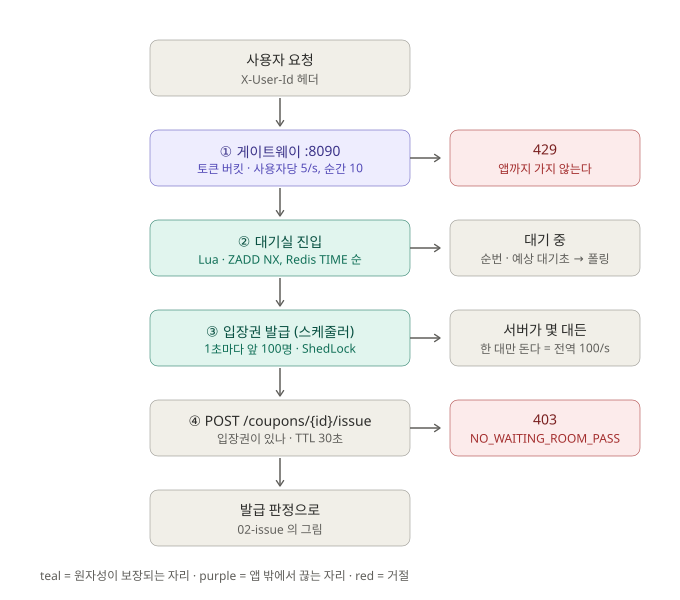

# 01. 진입 제어 — 게이트웨이와 대기실

**맡는 일:** 발급 API 앞에서 **얼마나, 누구를** 들여보낼지 정한다. 발급 판정 자체는 하지 않는다.

- **① 게이트웨이(8090)** 가 사용자별 토큰 버킷(초당 5, 순간 10)으로 어뷰저를 **앱 앞에서** 끊는다. 앱(8080)은 그대로라 기존 측정 트랙의 기준선이 안 깨진다.
- **② 대기실 진입**은 Lua 한 번이다. 순번은 `Redis TIME` 으로 매기므로 서버가 여러 대여도 시계가 하나고, `ZADD NX` 라 새로고침해도 순번이 안 밀린다.
- **③ 입장권 발급**은 1초마다 줄 앞 100명에게 TTL 30초짜리 입장권을 준다. 꺼내기와 지우기가 한 Lua 안이라 두 번 통과가 없다. **ShedLock** 으로 서버가 몇 대든 한 대만 돈다.
- **④ 발급 API** 는 입장권이 없으면 403 으로 끊는다. 통과하면 [02. 발급 판정](02-issue.md) 으로 간다.

---

## 무엇을 했나

### 대기실 — 발급 API 에 닿는 양을 10분의 1로

- **문제.** 1,000 rps 가 20초 동안 들어오면 20,000건이 전부 발급 API 까지 간다.
- **시도.** 줄(ZSET) + 초당 100명 통과 + 입장권. 통과 속도를 전역으로 지키려고 스케줄러에 ShedLock 을 걸었다.
- **결과.**

  | 모드 | 진입 요청 | 발급 API 까지 간 수 | 환산 |
  |---|---:|---:|---:|
  | 대기실 없음 | 20,000 | 20,000 | — |
  | 서버 1대 | 20,001 | **2,100** | 105/s |
  | 서버 2대 | 20,001 | **2,000** | **100/s** |

  서버를 2배로 늘려도 100/s 그대로인 것이 **락이 실제로 걸려 있다는 증거**다. 2,100과 2,000의 차이는 오차가 아니라 드레인 1회분이다.
  사용자 여정(진입 → 폴링 → 발급) 2,000명 시나리오에서 2,000/2,000 발급 PASS.

### 게이트웨이 — 대기실이 구별 못 하는 어뷰저를 앞에서 끊기

- **문제.** 대기실 입장에서 어뷰저는 "줄에 2,001번 선 사람" 일 뿐이라 구별이 안 된다.
- **시도.** Spring Cloud Gateway 의 Redis 토큰 버킷을 `X-User-Id` 단위로 걸었다. 강의 원본처럼 8090 에 따로 띄워, 앱을 직접 때리는 기존 측정은 영향이 없게 했다.
- **결과.** 어뷰저 200/s + 정상 사용자 20/s × 10초에서 어뷰저 **2,001건 중 65건만** 앱에 닿았고(96.8% 컷), **정상 사용자 차단 0**.
  끊기는 응답은 0.85ms, 통과는 3.56ms — 싸게 끊는다.

## 틀렸던 것

- **라우트 경로가 틀려도 PASS 가 나왔다.** 강의 원본 경로(`/api/coupons/...`)를 그대로 두면 이 저장소의 발급 API(`/api/v1/...`)는 게이트웨이를 아예 안 거친다. 그런데 k6 은 대기실만 때리므로 초록색이 찍힌다. 조용히 틀리는 자리라 설정 파일에 경위를 주석으로 남겼다.
- **대조군을 잘못 쟀다.** "대기실 없음" 기준선을 대기실이 **들어 있는** 이미지에서 돌렸더니 20,001건이 전부 403 이었다. 그런데 k6 은 정상 종료했고 러너는 `http_reqs = 20001` 을 결과처럼 찍었다 — 잰 것은 발급 처리량이 아니라 "게이트가 거절하는 속도" 였다. 그대로 대조군으로 썼으면 정반대 결론이 났다. 그래서 프로브가 기능이 **있나**만이 아니라 모드별로 **있어야 하나 없어야 하나**까지 확인하게 했다.

## 남은 과제

- **방과 줄에 TTL 이 없다.** 행사가 끝나도 드레인이 매초 죽은 방을 훑고, 이미 떠난 사용자에게 입장권을 계속 준다. 강의 진도에 맞춰 다룰 자리로 기록만 해 뒀다.
- **폴링 총량이 사용자 수의 제곱에 비례한다.** 200명에선 안 보였고 2,000명에서 꼬리 사용자가 17번 폴링했다. 사용자가 늘면 대기실 자체가 부하가 된다.
- **여정 측정은 2,800명 근처가 천장이다.** 러너의 최대 대기 30초가 상수이고 입장권 TTL 도 30초라, 더 붐비는 조건을 재려면 둘을 같이 파라미터로 빼야 한다.

> 근거: [`availability-track.md`](../availability-track.md) §2, §3, §6, §7
