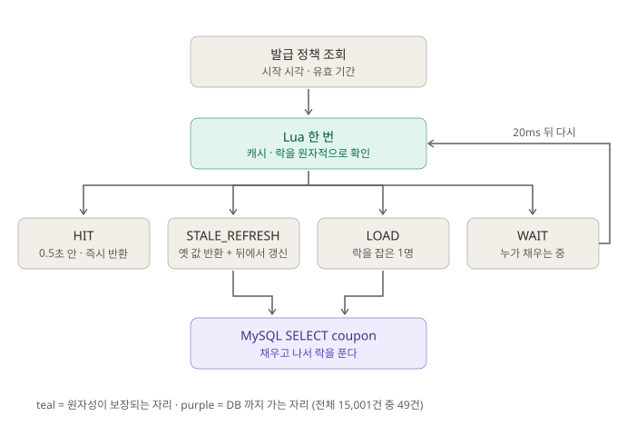

# 04. 조회 캐시 — 같은 결과를 더 싸게

**맡는 일:** 발급 판정에 필요한 읽기(발급 정책, 매진 여부)를 DB·Redis 까지 덜 가게 한다. 결과는 바꾸지 않고 **비용만** 줄인다.

- 발급 정책은 **Lua 한 번**으로 캐시 값·신선도·락을 같이 본다. 결과는 네 갈래다.
  - **HIT** — 0.5초(fresh) 안이면 그대로.
  - **STALE_REFRESH** — 오래됐지만 TTL(10초) 안이면 **옛 값을 바로 주고** 뒤에서 갱신한다.
  - **LOAD** — 비었고 락을 잡았으면 내가 DB 에서 채운다.
  - **WAIT** — 누가 채우는 중이면 20ms 뒤 다시 묻는다.
- 매진 여부는 이것과 별개로 **Caffeine L1**(프로세스 안, 1초)에 둔다. 매진 후 새로고침 폭주는 Redis 에도 안 간다.

---

## 무엇을 했나

같은 결과를 내는 데 드는 비용을 재는 트랙이라, 단계마다 **판정 지표를 다르게** 잡았다. stampede 를 없애는 단계는 DB 조회 수, SWR 단계는 p99.

### 발급 정책 조회 — 500 rps × 30s

| 태그 | 바꾼 것 | DB 조회 | p99 |
|---|---|---:|---:|
| `cache-4-0` | 매 요청 DB | 15,001 | 747.91ms |
| `rediscache-4-1` | Redis read-through | 1,250 | 102.37ms |
| `single-flight-4.2` | 락으로 로더 1개만 | **27** | 103.11ms |
| `swr-4.3` | Stale-While-Revalidate | 49 | **1.66ms** |

- **read-through 의 1,250은 거의 전부 stampede 였다.** TTL 이 끝나는 순간 몰린 요청이 전부 DB 로 갔다. 산수로 맞아떨어졌다.
- **single-flight 는 DB 조회를 이론적 바닥(27)까지 줄였지만 p99 는 그대로였다.** 기다리는 요청들이 로더를 기다리긴 마찬가지라서다. 예상대로였고, 그래서 이 단계는 카운터로 판정했다.
- **SWR 은 반대 축을 움직였다.** DB 조회는 27 → 49로 늘었지만 회귀가 아니라 노브(fresh 창)의 결과고, 사용자는 더 이상 로더를 안 기다린다.
- **DB 부하와 사용자 지연은 같이 움직이지 않는다** — 이 트랙의 요지다.
- 4-0 을 같은 조건으로 다시 재 보니 예상보다 훨씬 나빴다. **커넥션 풀이 포화(ρ 1.0)** 로 돌고 있었다. 캐시가 실제로 산 것은 DB 조회 수가 아니라 **풀 점유율을 1.0 → 0.08 로 내린 것**이다 — 조회를 흡수하면 그 요청이 잡고 있던 커넥션·트랜잭션까지 같이 사라진다.

### 매진 즉시 차단 — 4,000 rps × 30s, 매진 후

`l1cache` 에서 매진 여부를 Caffeine L1 에 두자 매진 후 요청 120,001건이 **전부** fast path 에서 끝났다. Redis 조회는 **30회**(L1 TTL 1초 × 30초, 이론값 그대로), 정책 캐시·DB 는 **0**. 응답 median 334µs.
L1 이 산 것은 지연보다 **Redis 여유**였다. 카운터는 워밍업 포함 네 라운드 전부 같았다.

### 마지막에 드러난 36% — `@Transactional`

캐시를 다 걷어내고 나서야 매진 요청 1건(1.40ms)의 원가가 쪼개졌다.

| 구성 | 비용 | 비중 |
|---|---:|---:|
| Redis 왕복 2회 | 566µs | 40% |
| **`@Transactional` (아무것도 안 지키는)** | **500µs** | **36%** |
| Tomcat + Caffeine + 예외 처리 | 334µs | 24% |

`issue` 는 DB 쓰기가 없는데 바깥 트랜잭션이 요청마다 커넥션을 잡고 있었다. 떼어 내자 p50·p90·p95 가 전부 **같은 상수(~500µs)만큼** 내려갔다 — 경합이 아니라 요청마다 붙던 고정 비용이었다는 뜻이다.
**이 단계에서 제일 큰 덩어리를 없앤 것은 캐시가 아니라 애노테이션 한 줄이었다.** 앞의 비용들에 묻혀 있다가 그것들을 걷어낸 뒤에야 보였다.

## 틀렸던 것

- **첫 실행이 두 번 연속 측정이 아니라 버그였다.** single-flight 는 첫 실행에서 100ms 로더가 한 번도 안 돌았는데(DB 조회 0, 캐시 적중 0) k6 `checks` 는 **100% 통과**했다. SWR 은 Lua `ARGV` 하나가 틀려 있었다. 그 뒤로는 숫자를 읽기 전에 카운터가 말이 되는지부터 본다.

## 남은 과제

- `@Transactional` 500µs 가 **MySQL 왕복 3회**(`SET autocommit` ×2 + rollback)라는 것은 산수로 좁힌 것이지 계측한 것이 아니다. `Com_rollback` / `Com_set_option` 을 라운드 전후로 재면 확인된다.
- 응답 분포의 꼬리는 매번 다르다. 태그당 1회 측정이라 10% 안팎 차이는 주장하지 않는다.

> 근거: [`load-test-efficiency.md`](../load-test-efficiency.md) §18–§22
