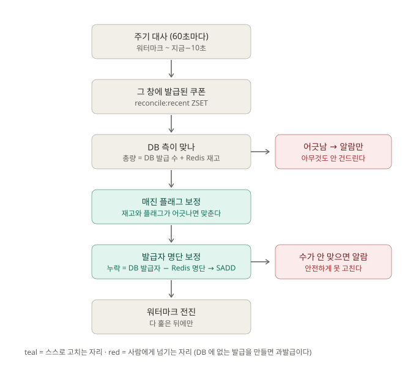

# 05. 정합성 — Redis 와 DB 대사

**맡는 일:** 재고의 진실(Redis)과 발급 기록(DB)이 어긋났을 때 **고칠 수 있는 것만 고치고, 나머지는 사람에게 넘긴다.**

- **재고의 진실은 Redis 에 있다.** `coupon.issued_quantity` 는 파생값이고, 동기화기가 1초마다 `총량 − Redis 재고` 로 통째로 덮어쓴다.
- **주기 대사**는 60초마다 최근 발급된 쿠폰만 훑는다. 먼저 DB 측이 맞는지 보고, **어긋나 있으면 알람만 내고 아무것도 안 건드린다.** DB 에 없는 발급을 대사가 만들어 내면 복구가 아니라 과발급이기 때문이다.
- DB 측이 맞을 때만 **매진 플래그**와 **Redis 발급자 명단**을 자동 보정한다. 명단은 "DB 발급자 − Redis 명단" 의 수가 정확히 맞을 때만 채운다.
- **워터마크** — 앱이 내려가 있었거나 스케줄이 밀려도 그 사이 발급이 창을 지나쳐 버리지 않게, 지난 회차의 상한부터 이어서 훑는다. 다 훑은 뒤에만 전진한다.

---

## 무엇을 했나

### 고칠 것과 알릴 것의 경계

- **문제.** 두 저장소에 나눠 쓰는 구조라 어긋남이 생길 수 있다([02](02-issue.md), [03](03-write.md) 의 과소발급). 그런데 무엇이든 자동으로 맞추면 대사가 과발급을 만든다.
- **시도.** 방향을 나눴다 — Redis 명단 누락은 DB 가 근거가 되므로 **자동 보정**, DB 측 불일치는 근거가 없으므로 **알람만**.
- **결과.** 16개 검증 항목 중 9개를 실측 PASS. 숫자가 코드의 계산과 정확히 맞았다.
  명단을 일부러 지운 뒤 **아무도 호출하지 않았는데 주기 대사가 스스로 복구**하는 것까지 확인했다.

### 대사가 DB 불일치를 구조적으로 못 잡고 있었다

- **문제.** 대사는 `issued_quantity` 를 "DB 가 아는 발급 수" 로 읽는데, 동기화기는 그 열을 "Redis 가 센 발급 수" 로 덮어쓴다. 대입하면 `DB 측 불일치 = 총량 − (총량 − 재고) − 재고 = 0`.
  **동기화기가 도는 한 이 값은 항상 0** 이다. 코드는 멀쩡해 보이고 로그도 안 남는다 — 검증이 `실제 0, 기대 10` 으로 FAIL 해서 알았다.
  대사를 켜려고 `@EnableScheduling` 을 켠 것이 그동안 잠자던 동기화기까지 깨운 것이 계기였다.
- **시도.** 동기화기를 지우면 정확성 트랙의 교차 검증이 깨진다. 그래서 지우지 않고 **주기를 설정으로 빼서** 대사 검증 동안만 끈다.
- **결과.** DB 측 불일치를 일부러 만들면 알람이 올라오고 재고는 그대로인 것을 확인했다.

## 틀렸던 것

- **다시 빌드하라는 안내가 원인을 잘못 짚었다.** 러너가 "소스와 이미지 단계가 다르니 다시 빌드하라" 며 멈췄는데, 몇 번을 빌드해도 그대로였다. 소스 감지(파일이 있나)와 런타임 감지(엔드포인트가 응답하나)가 **서로 다른 기준**이라 단계를 다 쓰기 전엔 반드시 어긋나는 구조였고, 그 사이 강의 원본 스크립트도 조용히 개정돼 있었다.
- **같은 열을 두 트랙이 반대 뜻으로 읽었다.** 위 "구조적으로 0" 이 그 결과다. 값이 맞아 보여도 **계산이 구조적으로 상쇄되고 있지 않은지**부터 본다.

## 남은 과제

- **7개 항목은 추가만 하고 아직 안 돌렸다.** 워터마크를 포함한 16개 전체 실행 결과를 남겨야 한다.
- **`autoFixed` 가 뭉쳐 있다.** 매진 플래그 보정과 명단 보정이 한 숫자라 `2` 가 나오면 무엇을 고쳤는지 모른다.
- **early return 이 명단 누락을 가린다.** DB 가 어긋난 쿠폰은 Redis 명단이 비어 있어도 사람이 DB 를 손볼 때까지 안 고쳐진다. 의도된 보수성이지만 지금은 로그 한 줄로만 남는다.
- **"최근 대사 대상" 판정이 약하다.** 등록됐는지만 보고, 그 시각이 실제로 창에 걸리는지는 간접적으로만 확인한다.

> 근거: [`consistency-track.md`](../consistency-track.md) · [`architecture.md`](../architecture.md) §2
