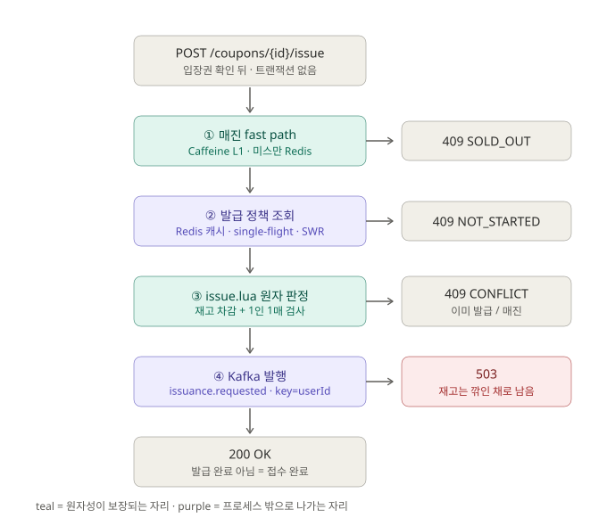
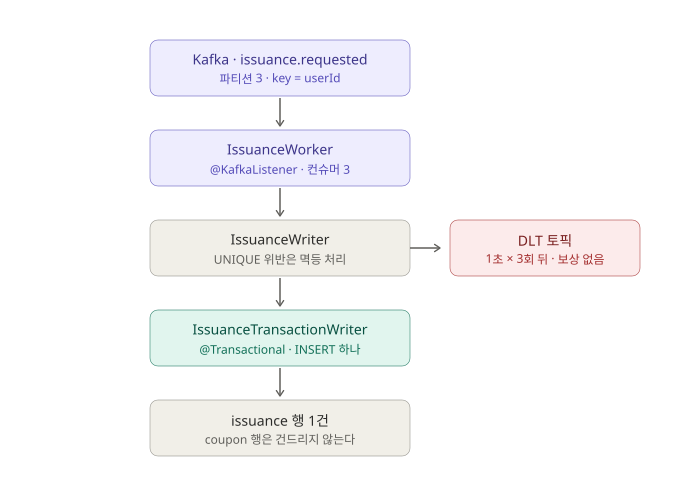
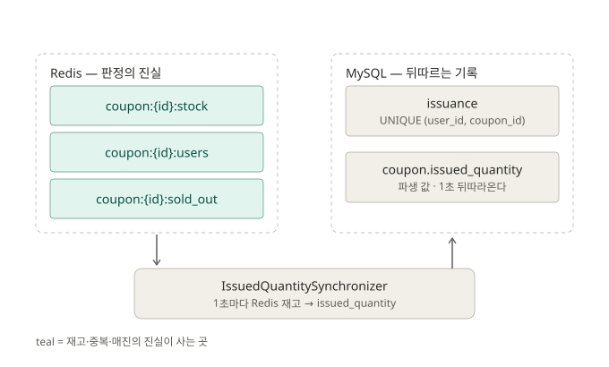

# 흐름 그림

[`architecture.md`](architecture.md) §2 의 흐름 트리를 그림으로 옮긴 것이다. **그 문서를 대체하지 않는다.**
왜 그렇게 되어 있는지(측정 근거, 되돌리지 말 것들)는 거기에 있고, 여기는 **지금 어떻게 흐르는지**만 본다.

기준 시점: 2026-08-17, `coupon-service:l1cache` (매진 fast path + 보상 제거 반영).
그림과 코드가 어긋나면 코드가 맞다 — 고칠 때 이 문서도 같이 고친다.

---

## 1. 동기 경로 — 사용자가 200 을 받기까지

관문 넷의 **순서 자체가 설계**다. 앞의 것일수록 싸고, 뒤로 갈수록 비싸다.
①은 프로세스 안(Caffeine)에서 끝나므로 매진 후 새로고침 폭주가 Redis 까지 가지 않고,
발급 자격 판정은 ③에서 **전부** 끝난다. ④는 판정이 아니라 접수다.

그림이 말하지 않는 것 셋.

- **`issue` 에는 `@Transactional` 이 없다** ([`CouponService.kt`](../src/main/kotlin/com/example/coupon/application/CouponService.kt)).
  이 경로에 DB 쓰기가 없고 읽기도 캐시 미스일 때의 `findById` 하나뿐인데, 그건 Spring Data 가 자기 트랜잭션을 연다.
  바깥 트랜잭션은 아무것도 안 지키면서 요청마다 커넥션을 잡고 있었다 ([`load-test-efficiency.md`](load-test-efficiency.md) §22.5).
- **200 은 "발급 완료" 가 아니라 "접수 완료"** 다. 응답 본문의 `id` 는 아직 저장 전이라 `null` 이고,
  실제 행은 2번 그림의 워커가 나중에 쓴다.
- **409 는 정상 동작이다.** 재고보다 요청이 많으면 `SOLD_OUT`, 1인 1매가 동작하면 `ALREADY_ISSUED`.
  부하 테스트에서 200 을 기대하면 안 되는 이유다.

③의 [`lua/issue.lua`](../src/main/resources/lua/issue.lua) 는 `SISMEMBER → GET → DECR → SADD` 네 단계를
Redis 서버 안에서 한 덩어리로 돈다. 왕복으로 나누면 그 틈에 같은 사람에게 두 장이 나가거나 재고가 음수가 된다.
**Lua 를 쓰는 이유는 속도가 아니라 이 원자성이다.**

---

## 2. 비동기 경로 — 발급 기록이 실제로 쓰이는 곳

사용자는 이미 떠났고, `issuance` 행은 여기서 만들어진다.

- **워커에는 `coupon` 행을 건드리는 쿼리가 없다.** 선착순이라 모든 발급이 그 단일 행을 향하고,
  InnoDB 는 그 행의 UPDATE 를 직렬화하므로 어디에 있든 그것이 그 경로의 상한이 된다.
  응답 경로에서 뺐다가(`lua-wb`) 워커 안으로 돌아왔고, 거기서도 뺐다(`kafka-nocount`).
- **UNIQUE 위반은 삼킨다.** 중복은 결함이 아니라 재처리의 정상 결과이므로 예외를 밖으로 뱉으면
  워커가 같은 메시지를 영원히 다시 먹는다.
- **DLT 로 가도 재고는 되돌리지 않는다.** 이유는 [`architecture.md`](architecture.md) §4 에 있다.

---

## 3. 두 저장소 — 무엇이 진실인가

**재고의 진실은 DB 가 아니라 Redis 에 있다.** `coupon.issued_quantity` 는 파생 값이고,
`IssuedQuantitySynchronizer` 가 1초마다 `total_quantity − (Redis 재고)` 로 통째로 덮어쓴다.

그래서 그 열은 "Redis 가 센 발급 수" 이고, 검증의 `count_match` 는 그 값과 "DB 에 실제로 들어간
`issuance` 행 수" 를 비교하는 **Redis ↔ DB 교차 검증**이 된다. `COUNT(*)` 로 채우면 언제나 일치해
검증이 아무것도 못 잡는다.

---

## 4. 정합성과 가용성 — 무엇을 지키려고 무엇을 놓았나

| 지키는 것 | 어디서 | 그 대가 |
|---|---|---|
| 전역 N장, 1인 1매 | [`lua/issue.lua`](../src/main/resources/lua/issue.lua) 원자 실행 | 없음 (판정은 강한 정합성) |
| 응답 가용성 | 쓰기를 Kafka 뒤로 | 200 = 접수. 기록은 최종 일관성 |
| 매진 차단 비용 | `SoldOutState` 의 Caffeine L1 | `coupon.sold-out.fast-path-ttl-ms` 동안 매진을 아직 모를 수 있다 |
| 조회 가용성 | `CouponCacheRepository` 의 SWR | `coupon.cache.fresh-ms` 만큼 오래된 정책을 쓸 수 있다 |
| 중복 최후 방어 | `uk_issuance_user_coupon` | 없음 (그래서 `duplicate_users` 는 항상 0 이다) |

**허용한 결함은 하나다.** 발행 실패(503)나 소비 실패(DLT)가 나면 그 한 장은 아무에게도 가지 않은 채
사라지고(과소발급), 그 사용자는 `coupon:{id}:users` 에 남아 다시 시도해도 거절된다.
**DB 안에는 모순이 없어 `verify` 의 세 판정이 전부 OK 로 통과하므로 ERROR 로그가 유일한 흔적이다.**
의도된 선택이고 경위는 [`architecture.md`](architecture.md) §4 에 있다.

위 표에서 뒤의 셋은 **"잠깐 틀려도 되는 값"** 이라 허용한 것이고, 첫째 줄만 틀리면 안 되는 값이다.
정합성을 한 곳(Lua)에 몰아넣은 대신 나머지를 전부 늦춘 것이 이 구조의 요지다.

---

## 5. 보류 체크포인트

지금 하지 않기로 한 것들. 필요해지면 여기서 시작한다.

### B. 과소발급을 관측하는 하네스

지금은 위 결함이 나도 DB 안이 모순 없어 `verify` 가 잡지 못한다.
`scripts/response/windows/verify-burst.ps1` 이 이미 매번 Redis 잔여 재고를 출력하므로,
`total_quantity − issuance 행 수` 와의 차이를 **판정으로 승격**시키면 된다.

착수 조건: 발행·소비 실패를 일부러 일으키는 시나리오가 필요하다(브로커 정지 등).
정상 부하에서는 이 경로가 한 번도 타지 않으므로 하네스만 만들면 늘 0 이 나온다.

### C. 보상(restore) 되살리기

필요한 것은 셋이다 — `restore.lua` 복원, 거기에 `KEYS[3] = sold_out` 을 받아 `INCR` 자리에서 `DEL`,
그리고 `IssuanceCompensator` 를 다시 두어 발행 실패와 소비 실패가 같은 정책을 쓰게 하는 것.

**왜 걷어냈는지를 먼저 읽을 것** — [`architecture.md`](architecture.md) §4.
보상이 복구한 재고를 자기가 세운 매진 플래그로 도로 막는 구조였다.
옛 구현은 git 이력의 `kafka-dlt-restore` 시점에 있다.
